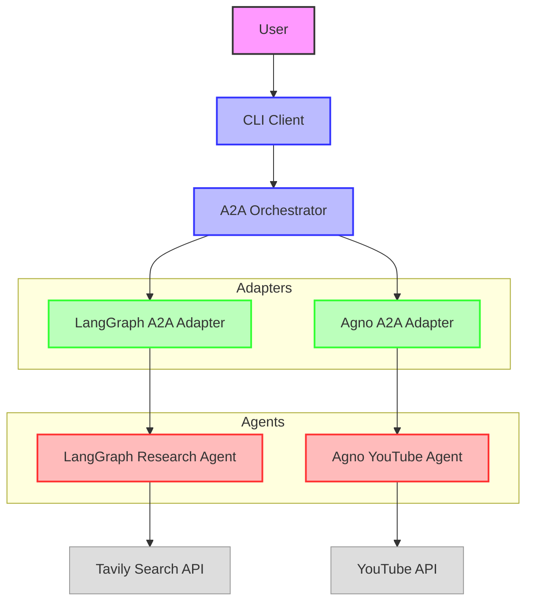

# Agent2Agent Architecture

## Component Description

### User Interface
- **CLI Client**: Command-line interface for interacting with the orchestrator

### Orchestration
- **A2A Orchestrator**: Central component that delegates tasks to specialized agents

### Adapters
- **LangGraph A2A Adapter**: Adapts the LangGraph agent to the A2A protocol
- **Agno A2A Adapter**: Adapts the Agno YouTube agent to the A2A protocol

### Agents
- **LangGraph Research Agent**: Research agent built with LangGraph
- **Agno YouTube Agent**: YouTube video analysis agent built with Agno

### External APIs
- **Tavily Search API**: Used by the LangGraph agent for web search
- **YouTube API**: Used by the Agno agent for video analysis
